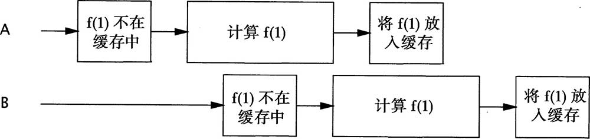

# 构建高效且可伸缩的结果缓存

```java
public interface Computable<A, V> {

    V compute(A arg) throws InterruptedException;
}

public class ExpensiveFunction implements Computable<String, BigInteger> {

    @Override
    public BigInteger compute(String arg) throws InterruptedException {
        // 经过长时间的运算后
        return new BigInteger(arg);
    }
}
```

## 使用HashMap和同步进行实现

<details>

<summary><mark style="color:purple;"><strong>Memorizer1</strong></mark></summary>

```java
public class Memorizer1<A, V> implements Computable<A, V> {

    private final Map<A, V> cache  = new HashMap<>();

    private final Computable<A, V> c;

    public Memorizer1(Computable<A, V> c) {
        this.c = c;
    }

    @Override
    public synchronized V compute(A arg) throws InterruptedException {
        V result = cache.get(arg);
        if (result == null) {
            result = c.compute(arg);
            cache.put(arg, result);
        }
        return result;
    }
}
```

</details>

HashMap不是线程安全的，因此要确保两个线程不会同时访问HashMap，**Memorizer1采用了一种保守的方法，即对整个compute方法进行同步**。

**这种方法能确保线程安全性，但会带来一个明显的可伸缩性问题：每次只有一个线程能够执行compute。**如果另一个线程正在计算结果，那么其他调用compute的线程可能被阻塞很长时间。如果有多个线程在排队等待还未计算出的结果，那么compute方法的计算时间可能比没有“记忆”操作的计算时间更长。

<figure><figcaption></figcaption></figure>

## 使用ConcurrentHashMap进行改进

<details>

<summary><mark style="color:purple;">Memorizer2</mark></summary>

```java
public class Memorizer2<A, V> implements Computable<A, V> {

    private final Map<A, V> cache = new ConcurrentHashMap<>();

    private final Computable<A, V> c;

    public Memorizer2(Computable<A, V> c) {
        this.c = c;
    }

    @Override
    public V compute(A arg) throws InterruptedException {
        V result = cache.get(arg);
        if (result == null) {
            result = c.compute(arg);
            cache.put(arg, result);
        }
        return result;
    }
}
```

</details>

Memorizer2用ConcurrentHashMap代替HashMap来改进Memorizer1中糟糕的并发行为。**由于ConcurrentHashMap是线程安全的，因此在访问底层Map时就不需要进行同步，因而避免了在对Memorizer1中的compute方法进行同步时带来的串行性。**

Memorizer2比Memorizer1有着更好的并发行为：多线程可以并发地使用它。但它的问题在于，**如果某个线程启动了一个开销很大的计算，而其他线程并不知道这个计算正在进行，那么很可能会重复这个计算。**

<figure><figcaption></figcaption></figure>

## 添加FutureTask进行改进

<details>

<summary><mark style="color:purple;">Memorizer3</mark></summary>

```java
public class Memorizer3<A, V> implements Computable<A, V> {

    private final Map<A, Future<V>> cache = new ConcurrentHashMap<>();

    private final Computable<A, V> c;

    public Memorizer3(Computable<A, V> c) {
        this.c = c;
    }

    @Override
    public V compute(A arg) throws InterruptedException {
        Future<V> f = cache.get(arg);
        if (f == null) {
            FutureTask<V> ft = new FutureTask<>(() -> c.compute(arg));
            f = ft;
            cache.put(arg, ft);
            ft.run();
        }
        try {
            return f.get();
        } catch (ExecutionException e) {
            throw new RuntimeException(e.getCause());
        }
    }
}
```

</details>

**Memorizer3将用于缓存值的Map重新定义为ConcurrentHashMap\<A, Future\<V>>，替换原来的ConcurrentHashMap\<A, V>**。

**Memorizer3首先检查某个相应的计算是否已经开始**（Memorizer2与之相反，它首先判断某个计算是否已经完成）。

* **如果还没有启动，那么就创建一个FutureTask，并注册到Map中，然后启动计算；**
* **如果已经启动，那么等待现有计算的结果。**

结果可能很快会得到，也可能还在运算过程中，但这**对于Future.get的调用者来说是透明的。**

Memorizer3的实现几乎是完美的：

* 它表现出了非常好的并发性，若结果已经计算出来，那么将立即返回。
* 如果其他线程正在计算该结果，那么新到的线程将一直等待这个结果被计算出来。

它只有一个缺陷，即**仍然存在两个线程计算出相同值的漏洞**。**这个漏洞的发生概率要远小于Memorizer2中发生的概率**，但**由于compute方法中的if代码块仍然是非原子（nonatomic）的“先检查再执行”操作，因此两个线程仍有可能在同一时间内调用compute来计算相同的值，即二者都没有在缓存中找到期望的值，因此都开始计算**。这个错误的执行时序如图所示。

<figure><figcaption></figcaption></figure>

## 使用putIfAbsent方法

<details>

<summary><mark style="color:purple;">Memorizer4</mark></summary>

```java
public class Memorizer4<A, V> implements Computable<A, V> {

    private final Map<A, Future<V>> cache = new ConcurrentHashMap<>();

    private final Computable<A, V> c;

    public Memorizer4(Computable<A, V> c) {
        this.c = c;
    }

    @Override
    public V compute(A arg) throws InterruptedException {
        while (true) {
            Future<V> f = cache.get(arg);
            if (f == null) {
                FutureTask<V> ft = new FutureTask<>(() -> c.compute(arg));
                f = cache.putIfAbsent(arg, ft);
                if (f == null) ft.run();
            }
            try {
                return f.get();
            } catch (CancellationException e) {
                cache.remove(arg);
            } catch (ExecutionException e) {
                throw new RuntimeException(e);
            }
        }
    }
}
```

</details>

**Memorizer4使用了ConcurrentMap中的原子方法putIfAbsent，避免了Memorizer3的漏洞。**

> 当缓存的是Future而不是值时，将导致<mark style="color:blue;">**缓存污染（Cache Pollution）问题**</mark>：**如果某个计算被取消或者失败，那么在计算这个结果时将指明计算过程被取消或者失败**。
>
> 为了避免这种情况，**如果Memoizer4发现计算被取消，那么将把Future从缓存中移除。**<mark style="color:blue;">**Memoizer4中的while(true) 循环的作为是为了在遇到缓存污染问题时，能够进行重试！**</mark>
