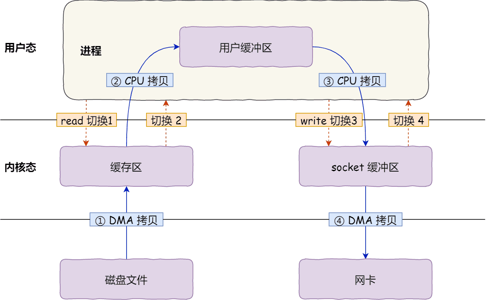
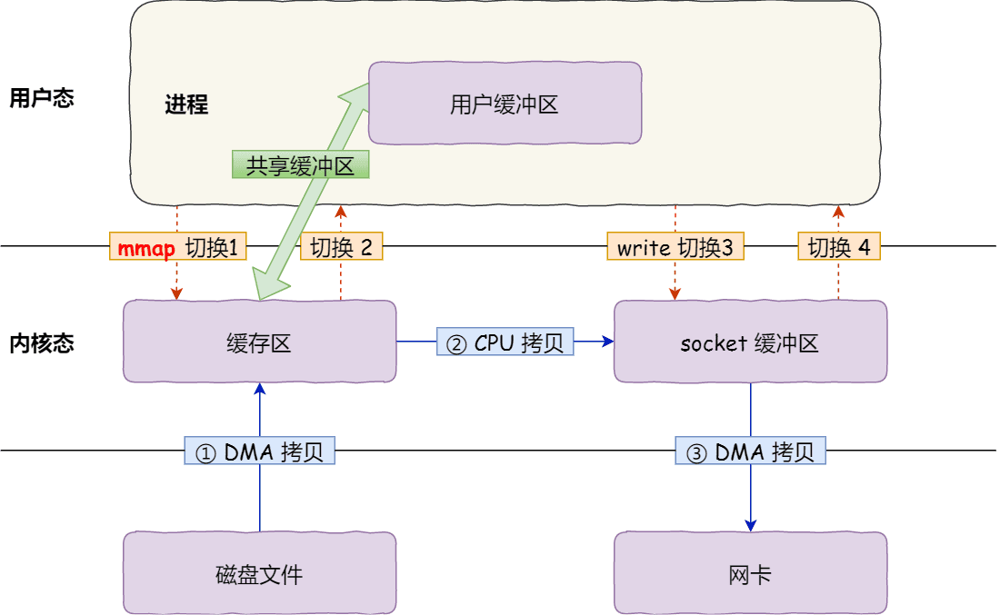
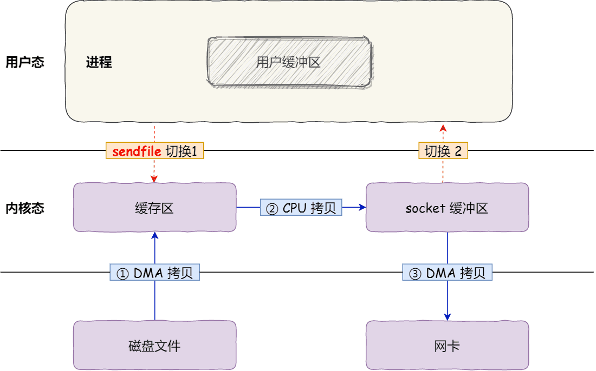
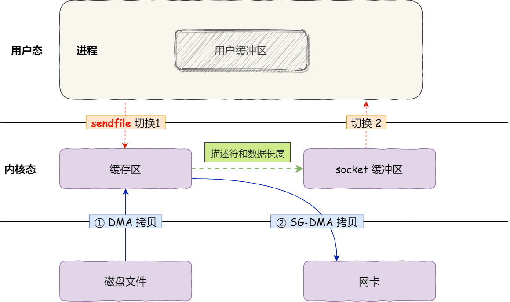

# 零拷贝

## **传统的IO存在什么问题？**

**传统 I/O 的工作方式是，数据读取和写入是从用户空间到内核空间来回复制，而内核空间的数据是通过操作系统层面的 I/O 接口从磁盘读取或写入。**

代码通常如下，一般会需要两个系统调用：

```java
read(file, tmp_buf, len);
write(socket, tmp_buf, len);
```

<figure><figcaption></figcaption></figure>

1.  <mark style="color:blue;">**共发生了 4 次用户态与内核态的上下文切换：**</mark>因为发生了两次系统调用，一次是 read() ，一次是 write()，**每次系统调用都得先从用户态切换到内核态，等内核完成任务后，再从内核态切换回用户态。**

    > <mark style="color:blue;">**上下文切换到成本并不小，一次切换需要耗时几十纳秒到几微秒，虽然时间看上去很短，但是在高并发的场景下，这类时间容易被累积和放大，从而影响系统的性能。**</mark>
2. <mark style="color:blue;">**共发生了 4 次数据拷贝，**</mark>其中**两次是 DMA 的拷贝**，另外**两次则是通过 CPU 拷贝**的：
   * **第一次拷贝**，**把磁盘上的数据拷贝到操作系统内核的缓冲区里**，这个拷贝的过程是通过 DMA 完成的。
   * **第二次拷贝**，**把内核缓冲区的数据拷贝到用户的缓冲区里**，于是应用程序就可以使用这部分数据了，这个拷贝到过程是由 CPU 完成的。
   * **第三次拷贝**，**把**刚才拷贝到**用户的缓冲区里的数据**，再**拷贝到内核的 socket 缓冲区**里，这个过程依然还是由 CPU 完成的。
   * **第四次拷贝**，**把内核的 socket 缓冲区里的数据，拷贝到网卡的缓冲区里**，这个过程又是由 DMA 搬运的。

**这种简单又传统的文件传输方式，存在冗余的上文切换和数据拷贝，在高并发系统里是非常糟糕的，多了很多不必要的开销，会严重影响系统性能。**

所以，<mark style="color:blue;">**要想提高文件传输的性能，就需要减少「用户态与内核态的上下文切换」和「内存拷贝」的次数**</mark><mark style="color:blue;">。</mark>

## **mmap + write 实现的零拷贝**

read() 系统调用会把内核缓冲区的数据拷贝到用户的缓冲区里，为了减少这一步的开销，可以用 mmap() 替换 read() 系统调用函数。

```java
buf = mmap(file, len);
write(sockfd, buf, len);
```

<mark style="color:blue;">**mmap() 系统调用函数会直接把内核缓冲区里的数据「映射」到用户空间**</mark>，这样，**操作系统内核与用户空间就不需要再进行任何的数据拷贝操作。**

<figure><figcaption></figcaption></figure>

具体过程如下：

1. 应用进程调用了 mmap() 后，DMA 会把磁盘的数据拷贝到内核的缓冲区里。接着，**应用进程跟操作系统内核「共享」这个缓冲区；**
2. 应用进程再调用 write()，**操作系统直接将内核缓冲区的数据拷贝到 socket 缓冲区中，这一切都发生在内核态，由 CPU 来搬运数据**；
3. 最后，把内核的 socket 缓冲区里的数据，拷贝到网卡的缓冲区里，这个过程是由 DMA 搬运的。

<mark style="color:blue;">**通过使用 mmap() 来代替 read()， 可以减少一次数据拷贝的过程，但仍然需要 4 次上下文切换。**</mark>

## **sendfile 实现的零拷贝**

在 Linux 内核版本 2.1 中，提供了一个专门发送文件的系统调用函数 sendfile()，函数形式如下：

```c
#include <sys/socket.h>
ssize_t sendfile(int out_fd, int in_fd, off_t *offset, size_t count);
```

它的前两个参数分别是目的端和源端的文件描述符，后面两个参数是源端的偏移量和复制数据的长度，返回值是实际复制数据的长度。

* **首先，它可以替代前面的 read() 和 write() 这两个系统调用，这样就可以减少一次系统调用，也就减少了 2 次上下文切换的开销。**
* **其次，该系统调用，可以直接把内核缓冲区里的数据拷贝到 socket 缓冲区里，不再拷贝到用户态，这样就只有 2 次上下文切换，和 3 次数据拷贝。**

如下图：

<figure><figcaption></figcaption></figure>

但是这还不是真正的零拷贝技术，<mark style="color:blue;">**如果网卡支持 SG-DMA（The Scatter-Gather Direct Memory Access）技术**</mark>（和普通的 DMA 有所不同），<mark style="color:blue;">**可以进一步减少通过 CPU 把内核缓冲区里的数据拷贝到 socket 缓冲区的过程。**</mark>

> 可以通过执行下述命令，查看网卡是否支持 scatter-gather 特性：
>
> ```bash
> $ ethtool -k eth0 | grep scatter-gather
> scatter-gather: on
> ```

对于支持网卡支持 SG-DMA 技术的情况下， sendfile() 系统调用的过程发生了点变化，具体过程如下：

* **第一步，通过 DMA 将磁盘上的数据拷贝到内核缓冲区里；**
* 第二步，缓冲区描述符和数据长度传到 socket 缓冲区，这样**网卡的 SG-DMA 控制器**就可以**直接将内核缓存中的数据拷贝到网卡的缓冲区里**，此过程不需要将数据从操作系统内核缓冲区拷贝到 socket 缓冲区中，这样就减少了一次数据拷贝；

所以，**在这个过程之中，只进行了 2 次数据拷贝**，如下图：

<figure><figcaption></figcaption></figure>

零拷贝技术的文件传输方式相比传统文件传输的方式，<mark style="color:blue;">**减少了 2 次上下文切换和数据拷贝次数，只需要 2 次上下文切换和数据拷贝次数，就可以完成文件的传输，而且 2 次的数据拷贝过程，都不需要通过 CPU，2 次都是由 DMA 来搬运**</mark><mark style="color:blue;">。</mark>
