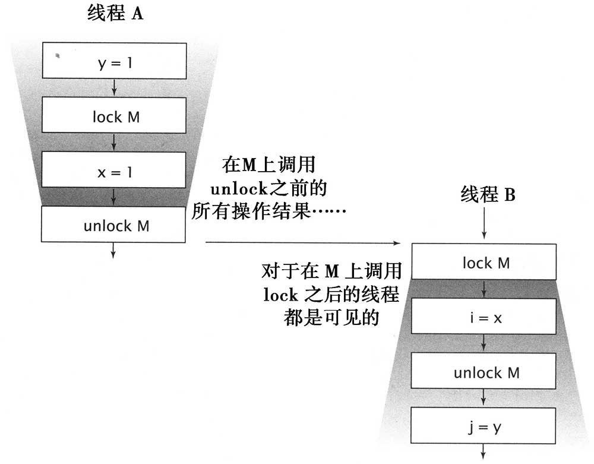

# 可见性

可见性是一个复杂的属性，因为可见性中的错误总是会违背我们的直觉。

在单线程环境中，如果向某个变量先写入值，然后在没有其他写入操作的情况下读取这个变量，那么总能得到相同的值。然而，当读操作和写操作在不同的线程中执行时，情况却并非如此。**通常，我们无法确保执行读操作的线程能适时地看到其他线程写入的值，**有时甚至是不可能的事情。

**为了确保多线程之间对内存写入操作的可见性，必须使用同步机制。**

## 加锁与可见性

**加锁的含义不仅局限于互斥行为，还包括内存可见性。**

<figure><figcaption></figcaption></figure>

## volatile 变量

当把变量声明为 volatile 类型后，编译器与运行时都会注意到这个变量是共享的，因此不会将变量上的操作与其他内存操作一起重排序。**volatile 变量不会被缓存在寄存器或者其他处理器不可见的地址，因此在读取 volatile 类型的变量时总会返回最新写入的值。**


## <mark style="color:blue;">提示</mark>

**当线程 A 首先写入一个 volatile 变量，并且线程 B 随后读取该变量时，在写入 volatile 变量之前对 A 可见的所有变量的值，在 B 读取了 volatile 变量后，对 B 也是可见的。**



## <mark style="color:orange;">注意</mark>

**如果在代码中依赖 volatile 变量来控制状态的可见性，通常比使用锁的代码更脆弱，也更难以理解。**

当且仅当满足以下所有条件时，才应该使用 volatile 变量：

* <mark style="color:blue;">**对变量的写入操作不依赖变量的当前值，或者能够确保只有单个线程更新变量的值**</mark>
* <mark style="color:blue;">**该变量不会与其他状态变量一起纳入不变性条件中**</mark>
* <mark style="color:blue;">**在访问变量时不需要加锁**</mark>


## **非原子的 64 位操作**

> ## 最低安全性
>
> 当线程在没有同步的情况下读取变量时，可能会得到一个失效值，但至少这个值是由之前某个线程设置的值，而不是一个随机值。这种安全性保证被称为**最低安全性（out-of-the-thin-air safety）**

最低安全性适用于绝大多数变量，但存在一个例外：非 volatile 类型的 64 位数值变量（double 和 long）。Java 内存模型要求，变量的读取操作和写入操作都必须是原子操作，但对于非 volatile 类型的 long 和 double 变量，JVM 允许将 64 位的读操作和写操作分解为两个 32 位的操作。
