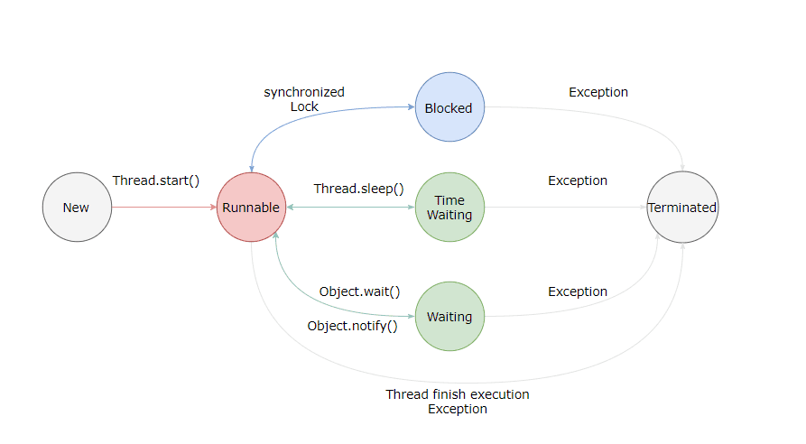

# 状态转换

<figure><figcaption></figcaption></figure>

Java 语言定义了 6 种线程状态，在任意一个时间点中，一个线程只能有且只有其中的一种状态，并且可以通过特定的方法在不同状态之间转换。这 6 种状态分别是：

* <mark style="color:blue;">**新建（New）**</mark>：**创建后尚未启动的线程处于这种状态。**
* <mark style="color:blue;">**可运行（Runnable）**</mark>：包括操作系统线程状态中的 Running 和 Ready，**处于此状态的线程有可能正在执行，也有可能正在等待着操作系统为它分配执行时间**。
*   <mark style="color:blue;">**无限期等待（Waiting）**</mark>：**处于这种状态的线程不会被分配处理器执行时间，它们要等待被其他线程显式唤醒。**

    > 以下方法会让线程陷入无限期的等待状态：
    >
    > * **没有设置 Timeout 参数的 Object::wait() 方法；**&#x20;
    > * **没有设置 Timeout 参数的 Thread::join()方法；**
    > * **LockSupport::park() 方法。**
*   <mark style="color:blue;">**限期等待（Timed Waiting）**</mark>：**处于这种状态的线程也不会被分配处理器执行时间，不过无须等待被其他线程显式唤醒，在一定时间之后它们会由系统自动唤醒。**

    > 以下方法会让线程进入限期等待状态：
    >
    > * **Thread::sleep() 方法；**&#x20;
    > * **设置了 Timeout 参数的 Object::wait() 方法；**&#x20;
    > * **设置了 Timeout 参数的 Thread::join() 方法；**
    > * **LockSupport::parkNanos() 方法；**
    > * **LockSupport::parkUntil() 方法。**
*   <mark style="color:blue;">**阻塞（Blocked）**</mark>：线程被阻塞了。**在程序等待进入同步区域的时候，线程将进入这种状态。**

    > “阻塞状态”与“等待状态”的区别是：“阻塞状态”在等待着获取到一个排它锁；而“等待状态”则是在等待一段时间，或者等待唤醒动作的发生。
* <mark style="color:blue;">**结束（Terminated）**</mark>：**已终止线程的线程状态，线程已经结束执行。**可以是线程结束任务之后自动结束，或者产生了异常而结束。
