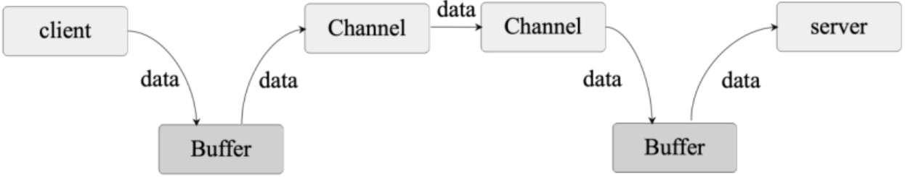

# NIO

Java NIO 的实现主要涉及三大核心内容：<mark style="color:blue;">**Selector（选择器）**</mark>、<mark style="color:blue;">**Channel（通道）**</mark>和<mark style="color:blue;">**Buffer（缓冲区）**</mark>。

* **Selector 用于监听多个 Channel 的事件**，比如连接打开或数据到达，因此，一个线程可以实现对多个数据 Channel 的管理。
* 传统 I/O 基于数据流进行 I/O 读写操作；而 **Java NIO 基于 Channel 和 Buffer 进行I/O读写操作**，并且**数据总是被从 Channel 读取到 Buffer 中，或者从 Buffer 写入 Channel 中**。

> Java NIO 和传统 I/O 的最大区别如下：
>
> * 传统 I/O 是面向流的，NIO 是面向缓冲区的。
> * 传统 I/O 的流操作是阻塞模式的，NIO 的流操作是非阻塞模式的

## Channel

<mark style="color:blue;">**Channel 和 I/O 中的 Stream（流）类似**</mark>，只不过 Stream 是单向的（例如InputStream、OutputStream），而 **Channel 是双向的，既可以用来进行读操作，也可以用来进行写操作**。

NIO中Channel的主要实现有：

* **FileChannel（文件的I/O）**
* **DatagramChannel（UDP）**
* **SocketChannel（TCP）**
* **ServerSocketChannel（Socker Server）**

## Buffer

<mark style="color:blue;">**Buffer 实际上是一个容器，其内部通过一个连续的字节数组存储 I/O 上的数据**</mark>。

**在 NIO 中，Channel 在文件、网络上对数据的读取或写入都必须经过Buffer：**

* 客户端在向服务端发送数据时，必须先将数据写入 Buffer 中，然后将 Buffer 中的数据写到服务端对应的 Channel 上。
* 服务端在接收数据时必须通过 Channel 将数据读入 Buffer 中，然后从 Buffer 中读取数据并处理。

<figure><figcaption></figcaption></figure>

> 在 NIO 中，Buffer 是一个抽象类，对不同的数据类型实现不同的 Buffer 操作。
>
> 常用的 Buffer 实现类有：ByteBuffer、IntBuffer、CharBuffer、LongBuffer、DoubleBuffer、FloatBuffer、ShortBuffer。

## Selector

<mark style="color:blue;">**Selector 用于检测在多个注册的 Channel 上是否有 I/O 事件发生，并对检测到的 I/O 事件进行相应的响应和处理。**</mark>因此通过一个Selector线程就可以实现对多个Channel的管理，不必为每个连接都创建一个线程，避免线程资源的浪费和多线程之间的上下文切换导致的开销。

同时，Selector 只有在 Channel 上有读写事件发生时，才会调用 I/O 函数进行读写操作，可极大减少系统开销，提高系统的并发量。

## 示例

要实现 Java NIO，就需要分别实现 Server 和 Client。

### Server

具体的 Server 实现代码如下：

<details>

<summary><mark style="color:purple;">MyServer</mark></summary>

```java
public  class  MyServer  {
    private  int  size  =  1024;
    private  ServerSocketChannel  serverSocketChannel;
    private  ByteBuffer  byteBuffer;
    private  Selector  selector;
    private  int  remoteClientNum  =  0;
    public  MyServer(int  port)  {
      try  {
          //在构造函数中初始化Channel监听
          initChannel(port);
      }  catch  (IOException  e)  {
          e.printStackTrace();
          System.exit(-1);
      }
    }
    //Channel的初始化
    public  void  initChannel(int  port)  throws  IOException  {
      //打开Channel
      serverSocketChannel  =  ServerSocketChannel.open();
      //设置为非阻塞模式
      serverSocketChannel.configureBlocking(false);
      //绑定端口
      serverSocketChannel.bind(new  InetSocketAddress(port));
      System.out.println("listener  on  port:  "  +  port);
      //选择器的创建
      selector  =  Selector.open();
      //向选择器注册通道
      serverSocketChannel.register(selector,  SelectionKey.OP_ACCEPT);
      //分配缓冲区的大小
      byteBuffer  =  ByteBuffer.allocate(size);
    }
    //监听器，用于监听Channel上的数据变化
    private  void  listener()  throws  Exception  {
      while  (true)  {
          //返回的int值表示有多少个Channel处于就绪状态
          int  n  =  selector.select();
          if  (n  ==  0)  {
              continue;
          }
          //每个selector对应多个SelectionKey，每个SelectionKey对应一个Channel
          Iterator<SelectionKey>  iterator  =
                                    selector.selectedKeys().iterator();
          while  (iterator.hasNext())  {
              SelectionKey  key  =  iterator.next();
              //如果SelectionKey处于连接就绪状态，则开始接收客户端的连接
              if  (key.isAcceptable())  {
                //获取Channel
            ServerSocketChannel  server =  (ServerSocketChannel) key.channel();
                //Channel接收连接
                SocketChannel  channel  =  server.accept();
                //Channel注册
                registerChannel(selector,  channel,  SelectionKey.OP_READ);
                //远程客户端的连接数
                remoteClientNum++;
                System.out.println("online  client  num="+remoteClientNum);
                write(channel, "hello  client".getBytes());
              }
              //如果通道已经处于读就绪状态
              if  (key.isReadable())  {
                read(key);
              }
              iterator.remove();
          }
      }
    }
    private  void  read(SelectionKey  key)  throws  IOException  {
      SocketChannel  socketChannel  =  (SocketChannel)  key.channel();
      int  count;
      byteBuffer.clear();
      //从通道中读数据到缓冲区
      while  ((count  =  socketChannel.read(byteBuffer))  >  0)  {
          //byteBuffer写模式变为读模式
          byteBuffer.flip();
          while  (byteBuffer.hasRemaining())  {
              System.out.print((char)byteBuffer.get());
          }
          byteBuffer.clear();
      }
      if  (count  <  0)  {
          socketChannel.close();
      }
    }
    private  void  write(SocketChannel  channel, byte[]  writeData)  throws IOException  {
      byteBuffer.clear();
      byteBuffer.put(writeData);
      //byteBuffer从写模式变成读模式
      byteBuffer.flip();
      //将缓冲区的数据写入通道中
      channel.write(byteBuffer);
    }
    private  void  registerChannel(Selector  selector,  SocketChannel  channel, int  opRead)  throws  IOException  {
      if  (channel  ==  null)  {
          return;
      }
      channel.configureBlocking(false);
      channel.register(selector,  opRead);
    }
    public  static  void  main(String[]  args)  {
      try  {
          MyServer  myServer  =  new  MyServer(9999);
          myServer.listener();
      }  catch  (Exception  e)  {
          e.printStackTrace();
      }
    }


}

```

</details>

在以上代码中定义了名为 MyServer 的服务端实现类，在该类中定义了：

* **serverSocketChannel** 用于ServerSocketChannel 的建立和端口的绑定；
* **byteBuffer** 用于不同 Channel 之间的数据交互；
* **selector** 用于监听服务器各个 Channel 上数据的变化并做出响应。

同时，在类构造函数中调用了初始化 ServerSocketChannel 的操作，定义了 listener 方法来监听 Channel 上的数据变化，解析客户端的数据并对客户端的请求做出响应。

### Client

具体的 Client 实现代码如下：

<details>

<summary><mark style="color:purple;">MyClient</mark></summary>

```java
public class MyClient {
    private int size = 1024;
    private ByteBuffer byteBuffer;
    private SocketChannel socketChannel;

    public void connectServer() throws IOException {
        socketChannel = SocketChannel.open();
        socketChannel.connect(new InetSocketAddress("127.0.0.1", 9999));
        socketChannel.configureBlocking(false);
        byteBuffer = ByteBuffer.allocate(size);
        receive();
    }

    private void receive() throws IOException {
        while (true) {
            byteBuffer.clear();
            int count;
            //如果没有数据可读，则read方法一直阻塞，直到读取到新的数据
            while ((count = socketChannel.read(byteBuffer)) > 0) {
                byteBuffer.flip();
                while (byteBuffer.hasRemaining()) {
                    System.out.print((char) byteBuffer.get());
                }
                send2Server("say  hi".getBytes());
                byteBuffer.clear();
            }
        }
    }

    private void send2Server(byte[] bytes) throws IOException {
        byteBuffer.clear();
        byteBuffer.put(bytes);
        byteBuffer.flip();
        socketChannel.write(byteBuffer);
    }

    public static void main(String[] args) throws IOException {
        new MyClient().connectServer();
    }
}
```

</details>

在以上代码中定义了 MyClient 类来实现客户端的 Channel 逻辑，其中：

* connectServer 方法用于和服务端建立连接
* receive 方法用于接收服务端发来的数据
* send2Server 用于向服务端发送数据。
