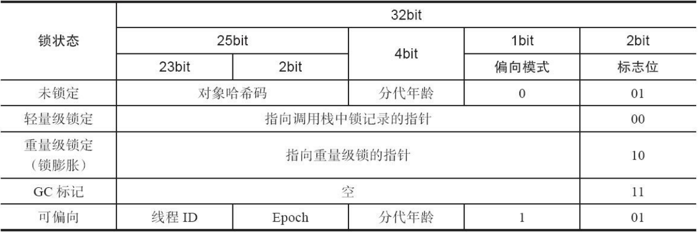

# 类加载器

**Java 虚拟机设计团队把类加载阶段中的“通过一个类的全限定名来获取描述此类的二进制字节流”这个动作放到 Java 虚拟机外部去实现，以便让应用程序自己决定如何去获取所需要的类**。实现这个动作的代码模块称为**“类加载器”**。


## <mark style="color:orange;">注意</mark>

<mark style="color:blue;">**对于任意一个类，都需要由加载它的类加载器和这个类本身一同确立其在 Java 虚拟机中的唯一性**</mark>，每一个类加载器，都拥有一个独立的类名称空间。这句话可以表达得更通俗一些：**比较两个类是否“相等”，只有在这两个类是由同一个类加载器加载的前提下才有意义**，否则，<mark style="color:orange;">**即使这两个类来源于同一个 Class 文件，被同一个虚拟机加载，只要加载它们的类加载器不同，那这两个类就必定不相等。**</mark>

这里所指的“相等”，包括代表类的 Class 对象的 equals() 方法、isAssignableFrom() 方法、isInstance() 方法的返回结果，也包括使用 instanceof 关键字做对象所属关系判定等各种情况。


## 类加载器的类别

从 Java 虚拟机的角度来讲，只存在两种不同的类加载器：

* 一种是启动类加载器（Bootstrap ClassLoader），这个类加载器使用 C++ 语言实现，是虚拟机自身的一部分；
* 另一种就是所有其他的类加载器，这些类加载器都由 Java 语言实现，独立于虚拟机外部，并且全都继承自抽象类 java.lang.ClassLoader。

从Java开发人员的角度来看，绝大部分 Java 程序都会使用到以下 3 种系统提供的类加载器：

* <mark style="color:blue;">**启动类加载器（Bootstrap ClassLoader）**</mark>
  * 这个类加载器负责加载存放在 **\<JAVA\_HOME>\lib 目录**，或者被 **-Xbootclasspath 参数**所指定的路径中存放的，而且是Java虚拟机能够识别的（按照文件名识别，如 rt.jar、tools.jar，名字不符合的类库即使放在 lib 目录中也不会被加载）类库加载到虚拟机的内存中。
  * **启动类加载器无法被 Java 程序直接引用**，**用户在编写自定义类加载器时，如果需要把加载请求委派给引导类加载器去处理，那直接使用 null 代替即可。**
* <mark style="color:blue;">**扩展类加载器（Extension Class Loader）**</mark>
  * 这个类加载器是在类 sun.misc.Launcher$**ExtClassLoader** 中以 Java 代码的形式实现的。
  * 它负责加载 **\<JAVA\_HOME>\lib\ext** 目录中，或者被 **java.ext.dirs** 系统变量所指定的路径中所有的类库。
  * 由于扩展类加载器是由 Java 代码实现的，开发者可以直接在程序中使用扩展类加载器来加载 Class 文件。
* <mark style="color:blue;">**应用程序类加载器（Application Class Loader）**</mark>
  * 这个类加载器由 **sun.misc.Launcher$AppClassLoader** 来实现。
  * 由于应用程序类加载器是 ClassLoader 类中的 getSystemClassLoader() 方法的返回值，所以有些场合中也称它为“系统类加载器”。
  * 它**负责加载用户类路径（ClassPath）上所有的类库**，开发者同样可以直接在代码中使用这个类加载器。
  * 如果应用程序中没有自定义过自己的类加载器，一般情况下这个就是程序中默认的类加载器。

## 双亲委派模型

<figure><figcaption></figcaption></figure>

上图展示的各种类加载器之间的层次关系被称为类加载器的**“双亲委派模型（Parents Delegation Model）”**。**双亲委派模型要求除了顶层的启动类加载器外，其余的类加载器都应有自己的父类加载器。**不过**这里类加载器之间的父子关系一般不是以继承（Inheritance）的关系来实现的**，**而是通常使用组合（Composition）关系来复用父加载器的代码。**

> 类加载器的双亲委派模型在 JDK 1.2 时期被引入，并被广泛应用于此后几乎所有的 Java 程序中，但它**并不是一个具有强制性约束力的模型，而是Java设计者们推荐给开发者的一种类加载器实现的最佳实践。**

双亲委派模型的工作过程是：<mark style="color:blue;">**如果一个类加载器收到了类加载的请求，它首先不会自己去尝试加载这个类，而是把这个请求委派给父类加载器去完成，每一个层次的类加载器都是如此。因此所有的加载请求最终都应该传送到最顶层的启动类加载器中，只有当父加载器反馈自己无法完成这个加载请求（它的搜索范围中没有找到所需的类）时，子加载器才会尝试自己去完成加载。**</mark>

使用双亲委派模型来组织类加载器之间的关系，一个显而易见的好处就是 Java 中的类随着它的类加载器一起具备了一种带有优先级的层次关系。例如类 java.lang.Object，它存放在 rt.jar 之中，无论哪一个类加载器要加载这个类，最终都是委派给处于模型最顶端的启动类加载器进行加载，因此 Object 类在程序的各种类加载器环境中都能够保证是同一个类。

<details>

<summary><mark style="color:purple;">双亲委派模型的实现——loadClass方法</mark></summary>

```java
protected synchronized Class<?> loadClass(String name, 
                boolean resolve) throws ClassNotFoundException {
    // 首先，检查请求的类是否已经被加载过了
    Class c = findLoadedClass(name);
    if (c == null) {
        try {
            if (parent != null) {
                c = parent.loadClass(name, false);
            } else {
                c = findBootstrapClassOrNull(name);
            }
        } catch (ClassNotFoundException e) {
            // 如果父类加载器抛出ClassNotFoundException
            // 说明父类加载器无法完成加载请求
        }
        if (c == null) {
            // 在父类加载器无法加载时
            // 再调用本身的findClass方法来进行类加载
            c = findClass(name);
        }
    }
    if (resolve) {
        resolveClass(c);
    }

    return c;
}
```

这段代码的逻辑清晰易懂：

* 先检查请求加载的类型是否已经被加载过，若没有则调用父加载器的 loadClass() 方法，若父加载器为空则默认使用启动类加载器作为父加载器。
* 假如父类加载器加载失败，抛出 ClassNotFoundException 异常的话，才调用自己的 findClass() 方法尝试进行加载。

</details>

## 破坏双亲委派模型

### JDK 1.2 之前的遗留代码

由于双亲委派模型在 JDK 1.2 之后才被引入，但是类加载器的概念和抽象类 java.lang.ClassLoader 则在 Java 的第一个版本中就已经存在，面对已经存在的用户自定义类加载器的代码，Java 设计者们引入双亲委派模型时不得不做出一些妥协，**为了兼容这些已有代码，无法再以技术手段避免 loadClass() 被子类覆盖的可能性，只能在 JDK 1.2 之后的 java.lang.ClassLoader 中添加一个新的 protected 方法 findClass()，并引导用户编写的类加载逻辑时尽可能去重写这个方法，而不是在 loadClass() 中编写代码。**

> loadClass() 方法，双亲委派的具体逻辑就实现在这里面，按照 loadClass() 方法的逻辑，如果父类加载失败，会自动调用自己的 findClass() 方法来完成加载，这样既不影响用户按照自己的意愿去加载类，又可以保证新写出来的类加载器是符合双亲委派规则的。

### JNDI服务

JNDI 服务现在已经是 Java 的标准服务，它的代码**由启动类加载器来完成加载**（在JDK 1.3时加入到rt.jar的）。

但 **JNDI 存在的目的就是对资源进行查找和集中管理，它需要调用由其他厂商实现并部署在应用程序的ClassPath 下的 JNDI 服务提供者接口（Service Provider Interface，SPI）的代码**，现在问题来了，**启动类加载器是绝不可能认识、加载这些代码的**，那该怎么办？

为了解决这个困境，Java 的设计团队只好引入了一个不太优雅的设计：<mark style="color:blue;">**线程上下文类加载器（Thread Context ClassLoader）**</mark>。**这个类加载器可以通过 java.lang.Thread 类的 setContextClassLoader() 方法进行设置，如果创建线程时还未设置，它将会从父线程中继承一个，如果在应用程序的全局范围内都没有设置过的话，那这个类加载器默认就是应用程序类加载器。**

**JNDI 服务使用这个线程上下文类加载器去加载所需的 SPI 服务代码，这是一种父类加载器去请求子类加载器完成类加载的行为**，这种行为实际上是打通了双亲委派模型的层次结构来逆向使用类加载器。Java 中涉及 SPI 的加载基本上都采用这种方式来完成，例如 JNDI、JDBC、JCE、JAXB 和 JBI 等。

> 不过，当 SPI 的服务提供者多于一个的时候，代码就只能根据具体提供者的类型来硬编码判断，为了消除这种极不优雅的实现方式，**在 JDK 6 时，JDK提供了 java.util.ServiceLoader 类，以META-INF/services 中的配置信息，辅以责任链模式，这才算是给 SPI 的加载提供了一种相对合理的解决方案。**

### OSGi

OSGi 实现模块化热部署的关键是它自定义的类加载器机制的实现，**每一个程序模块（OSGi 中称为Bundle）都有一个自己的类加载器，当需要更换一个 Bundle 时，就把 Bundle 连同类加载器一起换掉以实现代码的热替换。**在OSGi环境下，类加载器不再双亲委派模型推荐的树状结构，而是进一步发展为更加复杂的网状结构。
